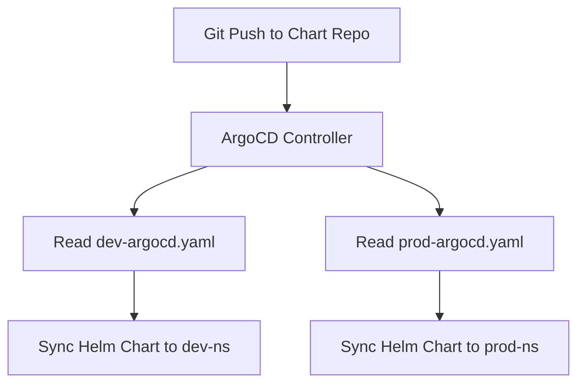

# 🛡️ OrganiStation Shared Workflows & CD

This repository serves as the **Central Orchestration Engine** for Continuous Integration (CI) compliance and GitOps Continuous Delivery (CD) across the entire OrganiStation platform.

---

## 🏗️ Reusable CI Strategy

Instead of maintaining independent, redundant build pipelines in 8+ different microservice repositories, we implement a single, unified source of truth:
**`reusable-ci.yaml`** (located in `.github/workflows/`)

### Benefits:
1. **Unified Standards**: Ensures every microservice passes the exact same rigorous security and quality controls.
2. **DRY Principle**: Pipeline bug-fixes or dependency upgrades made in this repository immediately propagate to all microservices.
3. **Immutable Image Tags**: Tags docker images with the first 7 characters of the git commit SHA (e.g. `a1b2c3d`) rather than fragile static version numbers.

---

## 🔒 Automated DevSecOps Audit Gates

Every build trigger executes a 5-layer security check before code is compiled or pushed:

| Audit Stage | Security Tool | Purpose |
| :--- | :--- | :--- |
| **Dockerfile Linting** | **Hadolint** | Validates Dockerfile security compliance (enforces non-root, pinned base tags). |
| **SCA Audit** | **Snyk (Python/Node)** | Scans dependencies for known vulnerabilities (fails build on HIGH or CRITICAL severity). |
| **Secrets Auditing** | **Trivy (Filesystem)** | Scans code directories for plaintext credentials, private keys, and API tokens. |
| **Quality & Coverage** | **SonarCloud** | Enforces static analysis quality gates, code smell thresholds, and test coverage rules. |
| **Container Audit** | **Trivy (Image)** | Per-layer audit of the compiled container image before pushing to Azure Container Registry (ACR). |

---

## 📦 Referencing in a Microservice

To enable the centralized build pipeline in any microservice, create a `.github/workflows/build.yaml` file in that service's repository:

```yaml
name: Build & Push Service

on:
  push:
    branches: [ develop, main ]

jobs:
  ci:
    uses: OrganiStation-org/shared-workflows/.github/workflows/reusable-ci.yaml@develop
    with:
      image_name: your-service-name
      language: python # or node
      sonar_org: organistation-org
      sonar_project_key: organistation_your-service-name
    secrets: inherit
```

---

## ⛵ Continuous Delivery via ArgoCD GitOps

We manage cluster state declaratively using **ArgoCD**. The `argocd/` directory houses the Application manifests that orchestrate GitOps synchronization on Azure Kubernetes Service (AKS).



### 🧪 Development Sync (`dev-argocd.yaml`)
- Tracks the `develop` branch of the `organistation-chart` Helm repository.
- Synchronizes changes to target namespace `dev-ns`.
- Enables automated **Pruning** (deletes orphaned resources) and **Self-Healing** (reverts manual changes in the cluster).

### 🚀 Production Sync (`prod-argocd.yaml`)
- Tracks the `main` branch of the `organistation-chart` Helm repository.
- Synchronizes changes to target namespace `prod-ns`.
- Enforces strict limits, replica anti-affinities, and resource allocations.

Both Application manifests dynamically inject critical environment parameters such as ACR endpoints, commit SHA image tags, Azure Key Vault parameters, and Workload Identity IDs.

---

## 🔑 Required Organization Secrets

For the reusable workflows to function correctly, the following Org-level secrets must be configured in GitHub:
* **Azure OIDC credentials**: `AZURE_CLIENT_ID`, `AZURE_TENANT_ID`, `AZURE_SUBSCRIPTION_ID`.
* **Security & Coverage tokens**: `SONAR_TOKEN`, `SNYK_TOKEN`.
* **Container Registries**: `ACR_LOGIN_SERVER`.
* **SMTP Alerts**: `SOURCE_EMAIL`, `EMAIL_PASSWORD`, `TARGET_EMAIL`.
